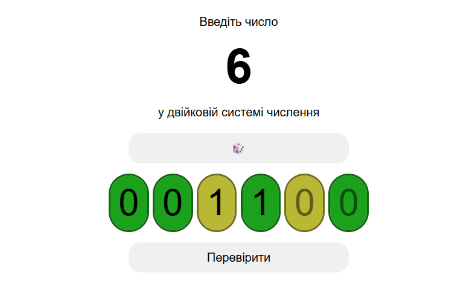

# Binarble

> 0️⃣0️⃣0️⃣1️⃣1️⃣0️⃣ A little Wordle-like website with binary code. But the binary system only uses 2 characters, which kind of defeats the Wordles purpose, so you don't have to guess anything here

Also, unlike the original Wordle game, the number takes 6 digits instead of 5, just because it allows for 64 (0-63) different numbers to be playble.

The number span is editable, if you click on it, so you can cheat a little bit. You can also specify the number in the URL query parameter 'n', for example https://binarble.skrw.me/?n=66 will always ask for 66 in binary.