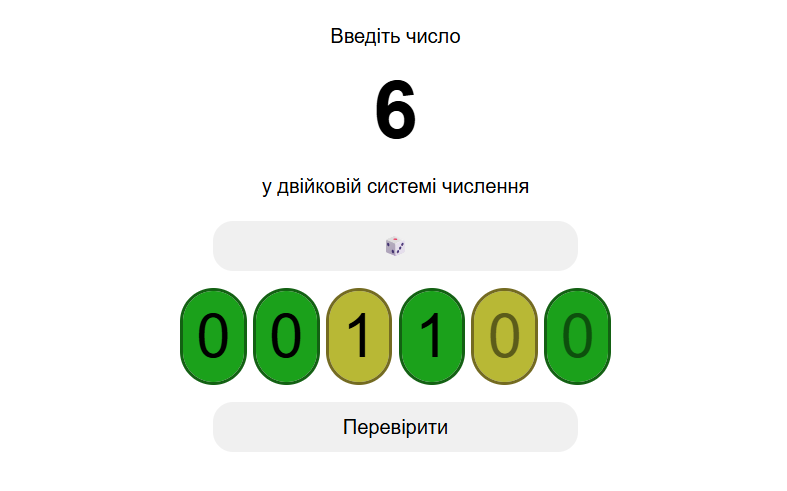

# Binarble

> 0️⃣0️⃣0️⃣1️⃣1️⃣0️⃣ A little Wordle-like website with binary code. But the binary system only uses 2 characters, which kind of defeats the purpose of the Wordle, so you don't have to guess anything here

Another difference from the original Wordle game is the 6-digit input instead of 5-digit, just because it allows more different numbers to be playable (0-63).

The decimal number is editable, if you click on it, so you can cheat a little bit. You can also specify the number in the URL query parameter 'n', for example https://binarble.skrw.me/?n=6 will always ask for 6 in binary.

## Dependencies

This project uses [Web Haptics ✨](https://github.com/lochie/web-haptics) for haptic feedback on mobile instead of [`navigator.vibrate`](https://developer.mozilla.org/en-US/docs/Web/API/Navigator/vibrate), since Apple devices lack support of it. This may increase load time, but I think it's worth it.

## Local testing and development

Because of the `import` usage (only needed for haptics), you have to run an HTTP server for the webpage to work, since it requires a script to be a module, which are not loadable from the regular HTML files. If you have Python installed, it is as easy as running `python -m http.server <port>` in your terminal inside of the project directory, and then your own local Binarble website will be available at `http://localhost:<port>`.